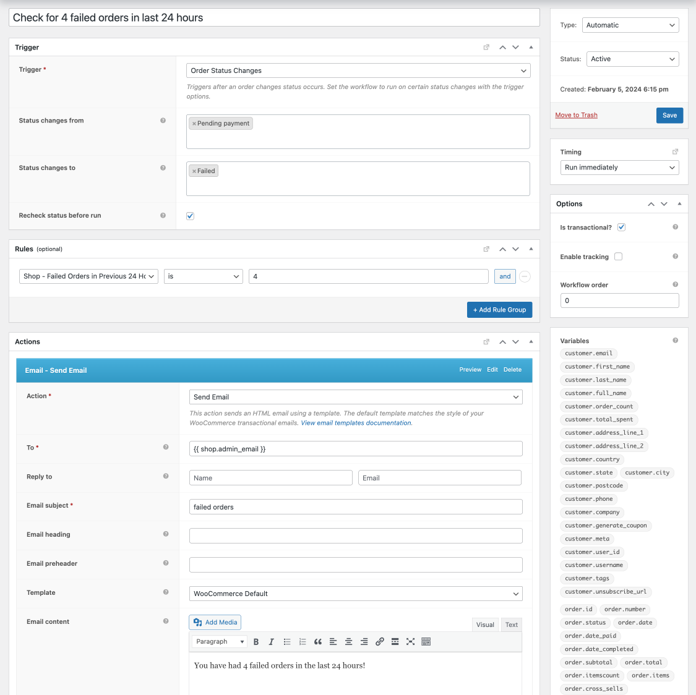

| :exclamation:  This is a public repository |
|--------------------------------------------|

# AutomateWoo Order Rule - Recent Failed Orders

Extends the functionality of AutomateWoo with 3 custom "Shop" rules which check for failed orders over the last 24 hours, 6 hours and 1 hour.

## Usage

Input your desired number of failed orders to check against. If your website has created that number of failed orders in that time period, the rule will return true, based on your comparator.

## Support

This plugin is provided without any support or guarantees of functionality. If you'd like to contribute, feel free to open a PR on this repo. If you have a request, please open an issue.

> [!WARNING]  
> Please test thoroughly before deploying to a production site.
